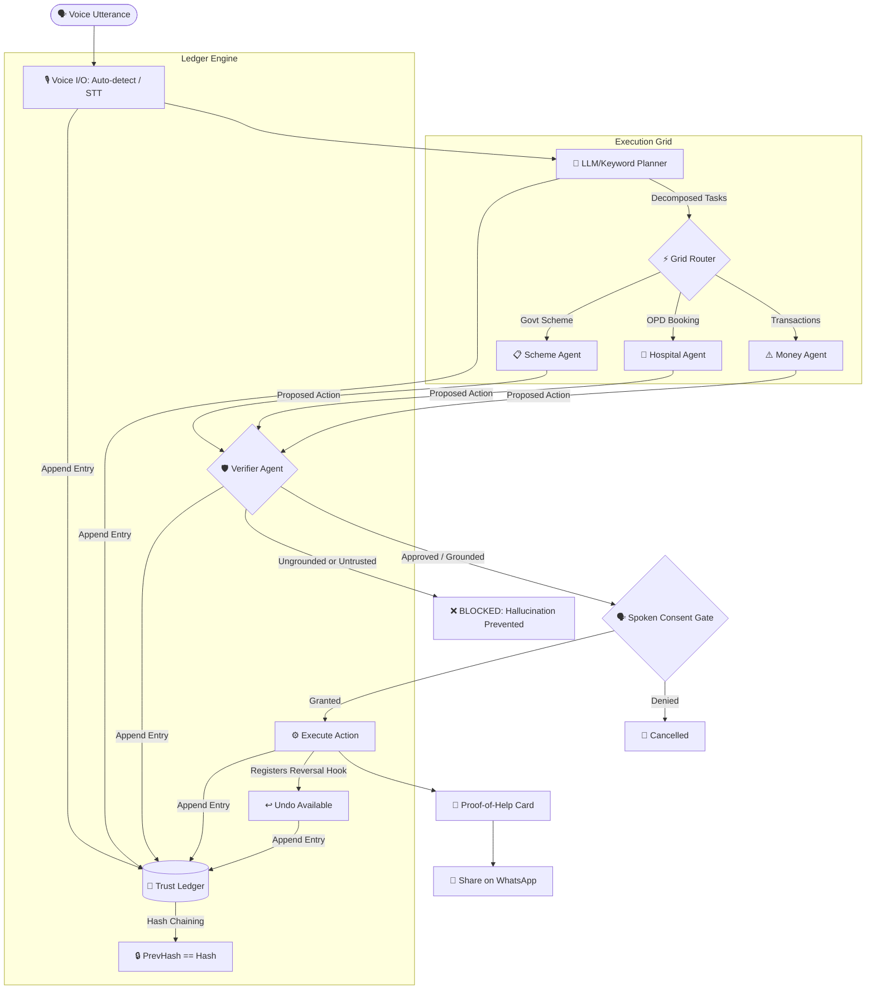

# 🇮🇳 Bharat Agent Grid

> **Live Vercel Deployment**: [https://bharat-agent-grid-main.vercel.app/](https://bharat-agent-grid-main.vercel.app/)  
> **Repository**: [https://github.com/guru-murtthy/Bharat-Agent-Grid.git](https://github.com/guru-murtthy/Bharat-Agent-Grid.git)

---

## 🌟 Overview & Problem Statement

Hundreds of millions of Indian citizens are non-English speaking, low-literacy, voice-first users. While current generative AI can *talk* in Indian languages, it cannot safely *act* (make bookings, apply for schemes, handle transactions) on behalf of citizens with verifiable trust. 

**Bharat Agent Grid** bridges this **last-mile trust, language, and agency gap**. It provides a voice-first, highly secure agentic layer that enables everyday citizens to speak their needs, automatically validates all actions against trusted authorities, records all operations in a tamper-evident audit ledger, and enables one-click reversibility (Undo) for all executed commands.

---

## 🎯 Challenge Track Mapping

Bharat Agent Grid deliberately connects all three hackathon challenges:

| Track / Challenge | Architectural Feature | Implementation |
| :--- | :--- | :--- |
| **Track 3: The Everyday AI Innovator (Life, Made Better)** | **Voice-First Vernacular Services** | Auto-detects and processes requests in Hindi, Kannada, and English. Orchestrates tasks like checking eligibility and applying for government schemes (PM-KISAN, Ayushman Bharat) or booking hospital slots. |
| **Track 1: The AI Systems Architect (Reimagining Work)** | **Anti-Hallucination Grounding & Cryptographic Trust Ledger** | A **Verifier** agent blocks any proposed action that does not cite a verified source-of-truth. Every state transition, user consent, and execution is recorded in a WORM (Write-Once-Read-Many) style hash-chained **Trust Ledger**. |
| **Track 2: The AI Growth Strategist (Making AI Go Viral)** | **Proof-of-Help Share Loop** | Successfully completed actions produce an on-screen, WhatsApp-shareable **Proof of Help** card with a vernacular referral code (`BAG-XXXXX`) to help literate members onboard families. |

---

## 🏗️ Architecture Flow



---

## 🛠️ Key Architectural Components

### 1. Voice I/O (`src/voice/`)
A voice-first layer designed for low-literacy users. It provides speech-to-text (STT) and text-to-speech (TTS) stubs mapped to auto-detect language structures, supporting English, Hindi, and Kannada.

### 2. Planner (`src/orchestrator/planner.py`)
Decomposes unstructured natural language utterances into structured `AgentTask` execution plans. Operates in zero-key fallback keyword mode or interfaces with OpenAI models for advanced routing.

### 3. Verifier (`src/agents/verifier.py`)
The ultimate security layer. Before any action is sent for execution, the Verifier validates that:
1. The action contains supporting citations.
2. At least one citation belongs to a **trusted domain** (e.g., `.gov.in`).
3. High-stakes or irreversible tasks (like money transfers) are restricted or flagged. If ungrounded, the task is marked as `BLOCKED`.

### 4. Trust Ledger (`src/trust_ledger/`)
An append-only, tamper-evident audit ledger. Each log entry stores the timestamp, actor, action, payload details, consent status, and a sha256 hash chained to the previous block's hash. If any entry is modified, the validation check instantly reports `TAMPER DETECTED`.

### 5. Growth Flywheel (`src/growth/`)
Creates digital sharing cards once an action is successfully verified and completed. Generates unique referral codes enabling local, word-of-mouth growth and family delegation loops.

---

## 💻 Local Quickstart

### Prerequisites
* Python >= 3.10
* Virtual environment tool (`venv`)

### 1. Installation
Clone the repository and initialize the Python environment:
```bash
# Clone the repository
git clone https://github.com/guru-murtthy/Bharat-Agent-Grid.git
cd Bharat-Agent-Grid

# Create virtual environment
python3 -m venv .venv
source .venv/bin/activate

# Install dependencies in editable mode
pip install -e ".[dev,llm]"
```

### 2. Run CLI Demo
Execute the terminal-based run demo to see the ledger and verifier logs:
```bash
python -m demo.run_demo
```

### 3. Run Web App Locally
Run the FastAPI backend:
```bash
uvicorn src.api.app:app --reload
```
Open `http://127.0.0.1:8000` in your web browser.

### 4. Run Test Suite
Run the test suite using pytest to verify system components (ledger, verifier, API, grid routing):
```bash
pytest -v
```

---

## 🐳 Docker Setup

Build and run the project inside a container:
```bash
# Build the image
docker build -t bharat-agent-grid .

# Run the container
docker run -p 8000:8000 bharat-agent-grid
```

---

## ☁️ Vercel Serverless Deployment

This project is configured to deploy directly to Vercel as a Python Serverless Function using [vercel.json](vercel.json).

### vercel.json
```json
{
  "version": 2,
  "builds": [
    {
      "src": "src/api/app.py",
      "use": "@vercel/python"
    }
  ],
  "routes": [
    {
      "src": "/(.*)",
      "dest": "src/api/app.py"
    }
  ]
}
```

To deploy using the Vercel CLI:
```bash
# Install Vercel CLI locally
npm install -g vercel

# Deploy to Production
vercel --prod
```
The Vercel Serverless builder automatically packages `requirements.txt` and routes all HTTP traffic directly to the FastAPI ASGI `app` instance.
